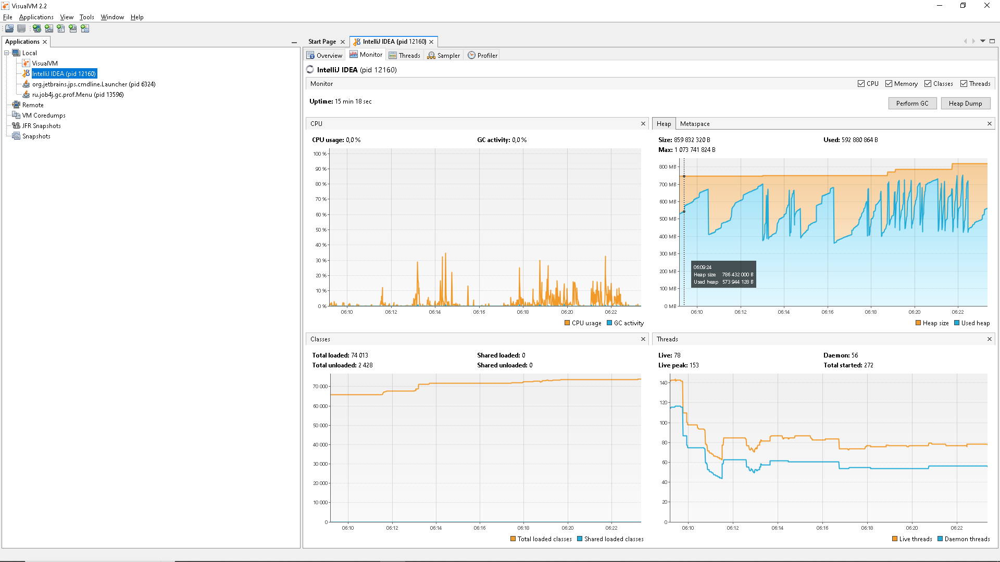
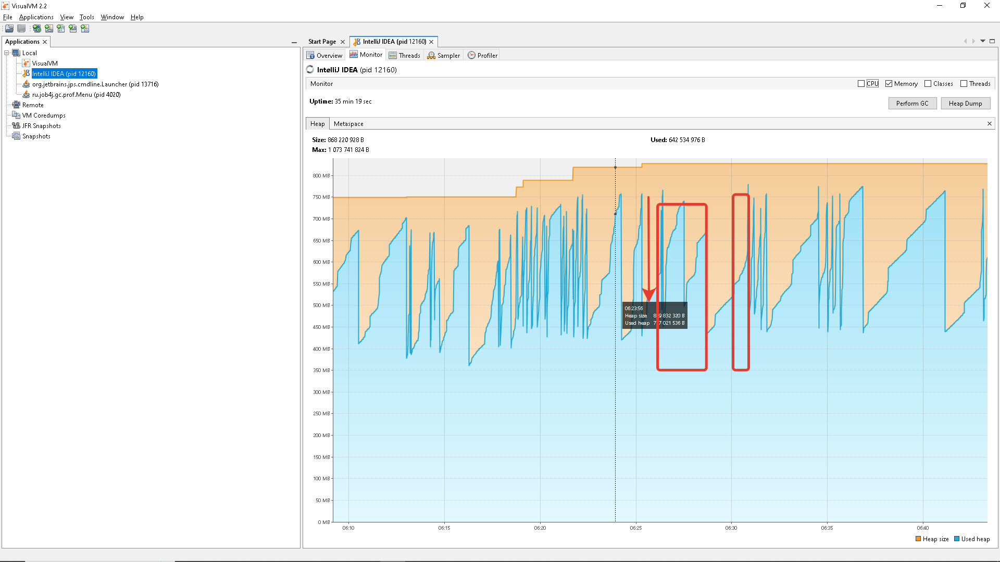

Parallel
Время каждой сборки
[2025-08-26T17:22:17.181+0300][info][gc] GC(0) Pause Young (Allocation Failure) 3M->1M(11M) 2.553ms
[2025-08-26T17:22:58.447+0300][info][gc] GC(1) Pause Young (Allocation Failure) 4M->4M(11M) 2.141ms
[2025-08-26T17:22:58.452+0300][info][gc] GC(2) Pause Young (Allocation Failure) 7M->4M(11M) 0.821ms
[2025-08-26T17:22:58.475+0300][info][gc] GC(3) Pause Young (Allocation Failure) 7M->4M(11M) 0.764ms
[2025-08-26T17:22:58.479+0300][info][gc] GC(4) Pause Young (Allocation Failure) 7M->4M(11M) 0.633ms
[2025-08-26T17:22:58.483+0300][info][gc] GC(5) Pause Young (Allocation Failure) 7M->4M(10M) 0.638ms
[2025-08-26T17:22:58.487+0300][info][gc] GC(6) Pause Young (Allocation Failure) 6M->5M(11M) 0.875ms
[2025-08-26T17:22:58.786+0300][info][gc] GC(7) Pause Young (Allocation Failure) 7M->5M(11M) 0.179ms
[2025-08-26T17:22:58.789+0300][info][gc] GC(8) Pause Young (Allocation Failure) 7M->5M(11M) 0.148ms
[2025-08-26T17:22:58.792+0300][info][gc] GC(9) Pause Young (Allocation Failure) 7M->5M(11M) 0.259ms
[2025-08-26T17:22:58.794+0300][info][gc] GC(10) Pause Young (Allocation Failure) 7M->5M(11M) 0.174ms
[2025-08-26T17:22:58.797+0300][info][gc] GC(11) Pause Young (Allocation Failure) 7M->5M(11M) 0.104ms
[2025-08-26T17:22:58.799+0300][info][gc] GC(12) Pause Young (Allocation Failure) 7M->6M(11M) 0.128ms
[2025-08-26T17:25:16.771+0300][info][gc] GC(13) Pause Young (Allocation Failure) 8M->5M(11M) 0.202ms

Наблюдения

Первая сборка (GC(0))

Через ~1 сек после старта.

Eden заполнился, освободилось 2МБ.

Основная нагрузка (GC(1) – GC(12))

Большая пачка сборок за доли секунды в 17:22:58.

Совпадает с моментом запуска сортировок.

Память

Использование памяти колебалось 7–8 МБ → после GC очищалось до 4–5 МБ.

В одном месте (GC(5)) размер кучи показан как 10M вместо 11M → Parallel GC динамически отрезал часть heap (оптимизация).

Parallel GC работает быстрее и эффективнее SerialGC:

без Full GC,

в пике нагрузок (множество коротких Young GC подряд).

---
G1
[2025-08-27T06:14:56.426+0300][info][gc] GC(0) Pause Young (Normal) (G1 Evacuation Pause) 25M->5M(128M) 3.046ms

MergeSort Начало сортировки - 06:14:56.367898400
MergeSort Конец сортировки - 06:14:56.438912900

BubbleSort Начало сортировки - 06:15:01.279092900
BubbleSort Конец сортировки - 06:16:39.320952600

InsertSort Начало сортировки - 06:17:15.207042500
InsertSort Конец сортировки - 06:17:20.462241100

Наблюдения

Сработал один раз во время сортировки MergeSort.

Было занято: 25M

После сборки: 5M

Общий heap: 128M.

Длительность паузы: ~3.0 ms

Выводы
В отличие от Parallel GC (где было много частых сборок при маленьком heap), здесь G1 отработал только один раз — за счёт большого хипа.

___
Z Garbage Collector
[2025-08-27T06:26:35.946+0300][info][gc] Using The Z Garbage Collector
[2025-08-27T06:26:51.333+0300][info][gc] GC(0) Garbage Collection (Warmup) 42M(33%)->6M(5%)

MergeSort Начало сортировки - 06:26:51.231690400
MergeSort Конец сортировки - 06:26:51.296705100

BubbleSort Начало сортировки - 06:26:53.631567700
BubbleSort Конец сортировки - 06:28:36.234627500

InsertSort Начало сортировки - 06:30:33.872566700
InsertSort Конец сортировки - 06:30:38.247856700

Сборщик: ZGC

Сработал один раз (warmup) — освободил память с 42M до 6M.

Вместо «жёстких пауз» (как у Serial/Parallel/G1) ZGC работает в конкурентном режиме → основная программа почти не останавливается.

В логе видно только факт сборки, но её «стоп-паузы» обычно укладываются в сотни микросекунд.

Наблюдения 

Минимум пауз. В отличие от Serial/Parallel/G1, здесь не видно цепочки «Pause Young» — ZGC почти всё делает параллельно с приложением.

Heap большой. Благодаря этому сортировки выполнялись почти без вмешательства сборщика.

